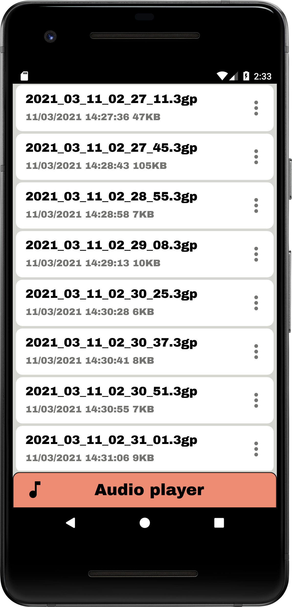
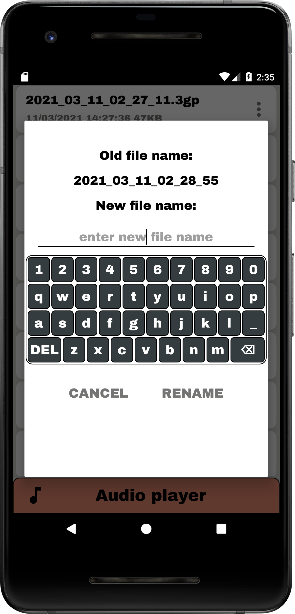
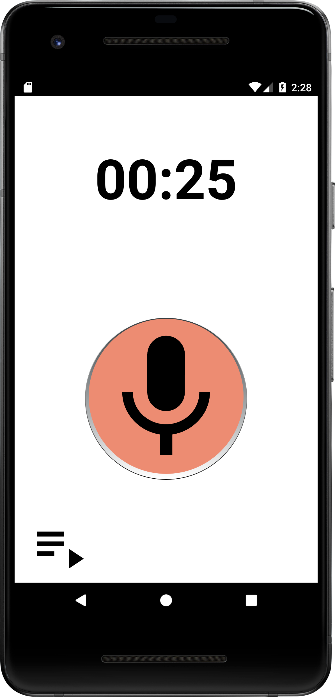
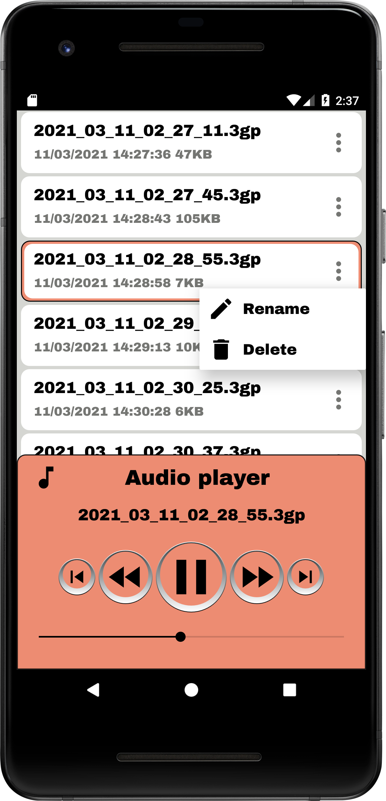

# VoiceRecorder
VoiceRecorder created in Android Studio

To start or stop audio recording press microphone ImageView. When audio is in process ImageView changes background color, Chronometer starts working.

Navigation component is used to reach FragmentAudioRecorder or FragmentAudioList.

For Audio player layout is used BottomSheetBehavior with expanded and collapsed states.

Custom keyboard is to input text into EditText field of Rename AlertDialog.

   
